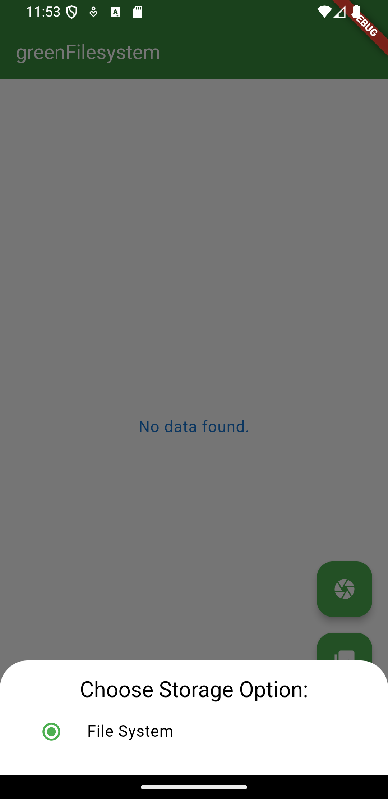

# OCR Calculator App

A Flutter application built with multiple flavors to handle different configurations and use cases. The app is used for Optical Character Recognition (OCR) combined with a simple calculator feature.

## Flavors

This app is built with the following flavors:

1. **Red Camera Roll**: Allows the user to select images from the gallery.
2. **Red Built-in Camera**: Captures images directly from the camera.
3. **Green Filesystem**: Stores data in the filesystem.
4. **Green Camera Roll**: Similar to `Green Filesystem` but retrieves images from the gallery.

Each flavor has its own specific theme and functionality. Below are the screenshots for each flavor.

### Red Camera Roll Flavor


### Red Built-in Camera Flavor


### Green Filesystem Flavor



### Green Camera Roll Flavor


---

## How to Run

### Debug Mode

To run the app in debug mode for a specific flavor, use the following commands:

```bash
flutter run --flavor redCameraRoll --dart-define=FLAVOR=redCameraRoll
flutter run --flavor redBuiltInCamera --dart-define=FLAVOR=redBuiltInCamera
flutter run --flavor greenFilesystem --dart-define=FLAVOR=greenFilesystem
flutter run --flavor greenCameraRoll --dart-define=FLAVOR=greenCameraRoll
```

### Build APK

To build APKs for all flavors:

```bash
flutter build apk --flavor redCameraRoll --dart-define=FLAVOR=redCameraRoll
flutter build apk --flavor redBuiltInCamera --dart-define=FLAVOR=redBuiltInCamera
flutter build apk --flavor greenFilesystem --dart-define=FLAVOR=greenFilesystem
flutter build apk --flavor greenCameraRoll --dart-define=FLAVOR=greenCameraRoll
```

### Install APKs

Once the APKs are built, install them using the following commands:

```bash
flutter install --flavor redCameraRoll
flutter install --flavor redBuiltInCamera
flutter install --flavor greenFilesystem
flutter install --flavor greenCameraRoll
```

---


